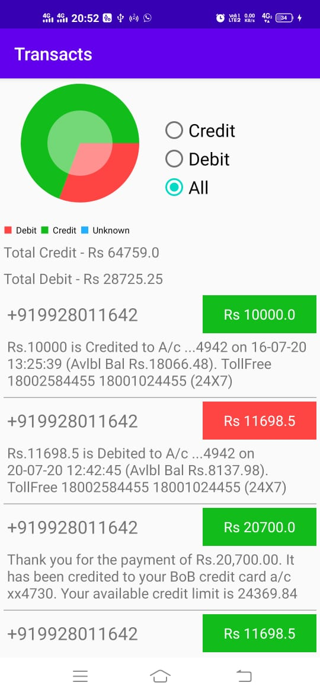

# Transacts

#### Problem Statement:
Create an android application that analyses all the SMS of the user, then findss all the transactional SMS.
1. App should generate a report which shows in a pie chart - Total Expenses and Total Income.
2. Create a view where user can see all the expense or income messages (SMS). This vie should have a filter to display either the expense or the income messages.

#### Solution Approach:
1. Analysis of messages by different banks and identifying similarities between them.
2. Use Regular Expressions to match for each property of a transactional message. Like these messages contains keywords like "credit", "debit", "account", etc.
3. Parse the messages with Cursor in Android and then store it in Room DB to query for further requirements.
4. Display a Pie Chart showing Total Credit, Total Debit and Undefined Transactions.(Undefined transactions are those in which the algorithm fails to classify any message as debit or credit)
5. Use RadioButtons to provide filter options between Credit and Debit messages.
6. At last, Tested the algorithm from transaction messages of SBI, Paytm Banks, and BOB credit cards.

#### About the app:
Number of Screens : 1
Min Supported SDK : 21
Tested On Android 10, API Level 28
Permissions Required : READ_SMS

#### Important Tools and Libraries Used:
Retrofit, Butterknife, RxJava, Room, RxPermissions, LiveData, ViewModel, MPAndroidChart, MVVM Architecture

#### Running the application
The apk submitted is a signed debug apk. Install the APK directly in your phone. If you face any issues, try enabling developer options and then install it. If the issue persists, install the app via Android Studio by compiling the code.